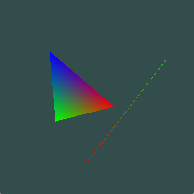

# jaragayt

## Run
```
make && ./main
```

## Images
_What the project looks like currently_



## Resources

- [learnopengl.com](https://learnopengl.com/)
  - [Getting Started](https://learnopengl.com/Getting-started/Review)
- [paroj.github.io/gltut](https://paroj.github.io/gltut)
  - [Chapter 5. Objects in Depth](https://paroj.github.io/gltut/Positioning/Tutorial%2005.html)
