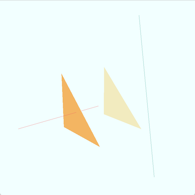

# jaragayt

## Run
```
make && ./main
```

## Images
### Current look

**Commit**: [26dfb9](https://github.com/SourenP/jaragayt/commit/26dfb9d9c4bb28695157361a2eb2aecde1e65892)

**Date**: April 5 2020

*Two lines and two triangles. One line interstecting one triangle causing their colors to change.*



## Resources

- [learnopengl.com](https://learnopengl.com/)
  - [Getting Started](https://learnopengl.com/Getting-started/Review)
- [paroj.github.io/gltut](https://paroj.github.io/gltut)
  - [Chapter 5. Objects in Depth](https://paroj.github.io/gltut/Positioning/Tutorial%2005.html)
